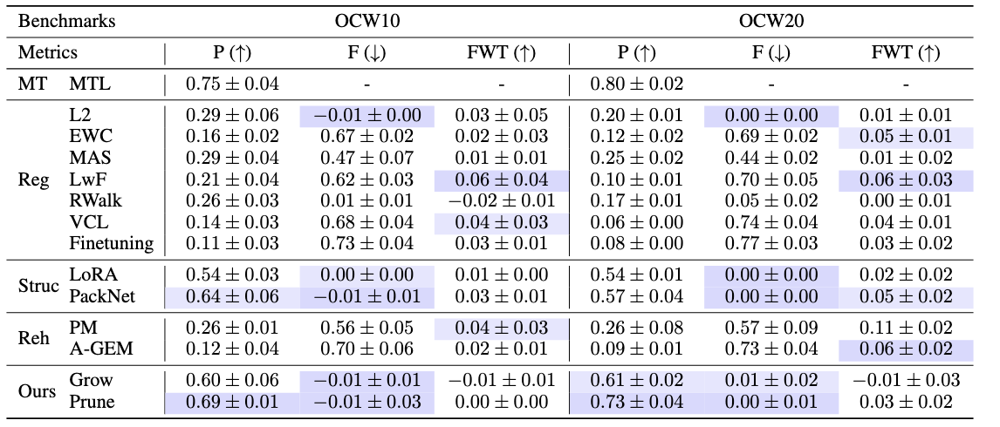
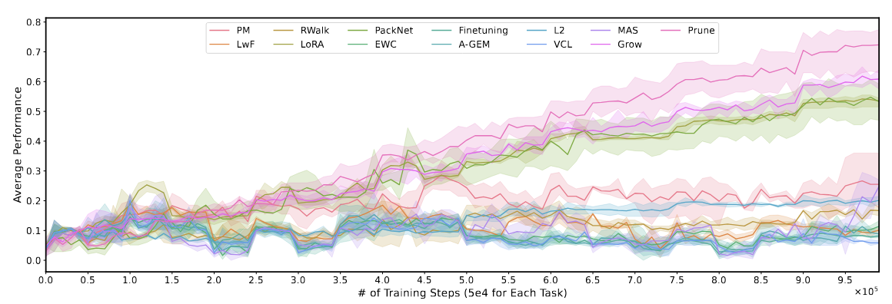

<p align="center" width="100%">
</p>

<div id="top" align="center">

Continual Task Learning through Adaptive Policy Self-Composition
-----------------------------
 


<h4> |<a href="https://arxiv.org/abs/2405.18080"> 📑 Paper </a> |
<a href="https://github.com/charleshsc/CompoFormerT"> 🐱 Github Repo </a> |
</h4>

<!-- **Authors:** -->

_**Shengchao Hu<sup>1,2</sup>, Yuhang Zhou<sup>1</sup>, Ziqing Fan<sup>1,2</sup>, Jifeng Hu<sup>3</sup>, Li Shen<sup>4</sup>, Ya Zhang<sup>1,2</sup>, Dacheng Tao<sup>5</sup>**_


<!-- **Affiliations:** -->


_<sup>1</sup> Shanghai Jiao Tong University,
<sup>2</sup> Shanghai AI Laboratory,
<sup>3</sup> Jilin University,
<sup>4</sup> Sun Yat-sen University,
<sup>5</sup> Nanyang Technological University._

</div>


## Contents

- [Overview](#overview)
- [Quick Start](#quick-start)
- [Citation](#citation)
- [Acknowledgements](#acknowledgments)


## Overview

Training a generalizable agent to continually learn a sequence of tasks from offline trajectories is a natural requirement for long-lived agents, yet remains a significant challenge for current offline reinforcement learning (RL) algorithms. Specifically, an agent must be able to rapidly adapt to new tasks using newly collected trajectories (plasticity), while retaining knowledge from previously learned tasks (stability). However, systematic analyses of this setting are scarce, and it remains unclear whether conventional continual learning (CL) methods are effective in continual offline RL (CORL) scenarios. 

In this study, we develop the **Offline Continual World benchmark** and demonstrate that traditional CL methods struggle with catastrophic forgetting, primarily due to the unique distribution shifts inherent to CORL scenarios. To address this challenge, we introduce CompoFormer, a structure-based continual transformer model that adaptively composes previous policies via a meta-policy network. Upon encountering a new task, CompoFormer leverages semantic correlations to selectively integrate relevant prior policies alongside newly trained parameters, thereby enhancing knowledge sharing and accelerating the learning process. Our experiments reveal that CompoFormer outperforms conventional CL methods, particularly in longer task sequences, showcasing a promising balance between plasticity and stability.


## Quick Start

Download the dataset MT50 via this [Google Drive link](https://drive.google.com/drive/folders/1Ce11F4C6ZtmEoVUzpzoZLox4noWcxCEb).

When your environment is ready, you could run the following script with corresponding dataset folder:
``` Bash
bash runs/cw10.sh # cw10
```

## Benchmark



## Citation
If you find this work is relevant with your research or applications, please feel free to cite our work!
```
@inproceedings{CompoFormer,
    title={Continual Task Learning through Adaptive Policy Self-Composition},
    author={Hu, Shengchao and Zhou, Yuhang and Fan, Ziqing and Hu, Jifeng and Shen, Li and Zhang, Ya and Tao, Dacheng},
    year={2024},
}
```

## Acknowledgments

This repo benefits from [DT](https://github.com/kzl/decision-transformer) and [FACIL](https://github.com/mmasana/FACIL). Thanks for their wonderful works!